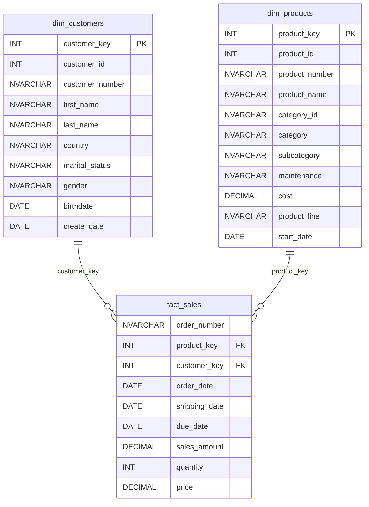

# Data Dictionary — Gold Layer

## Overview

The Gold Layer represents the final, business-ready data models in the **DB_WAREHOUSE** data warehouse. It contains dimension and fact tables (implemented as views) that are optimized for reporting and analytics.

---

## 1. `gold.dim_customers` — Customer Dimension

**Description:** Contains one row per customer with enriched attributes sourced from CRM and ERP systems.

**Source Tables:**

- `silver.crm_cust_info` (master customer data)
- `silver.erp_cust_az12` (ERP customer demographics)
- `silver.erp_loc_a101` (ERP customer location)

| Column Name     | Data Type    | Description                                                                           |
| --------------- | ------------ | ------------------------------------------------------------------------------------- |
| customer_key    | INT          | Surrogate key uniquely identifying each customer record in the dimension table.       |
| customer_id     | INT          | Unique numerical identifier assigned to each customer.                                |
| customer_number | NVARCHAR(50) | Alphanumeric identifier representing the customer, used for tracking and referencing. |
| first_name      | NVARCHAR(50) | The customer's first name, as recorded in the system.                                 |
| last_name       | NVARCHAR(50) | The customer's last name or family name.                                              |
| country         | NVARCHAR(50) | The country of residence for the customer (e.g., 'Australia').                        |
| marital_status  | NVARCHAR(50) | The marital status of the customer (e.g., 'Married', 'Single').                       |
| gender          | NVARCHAR(50) | The gender of the customer (e.g., 'Male', 'Female', 'n/a').                           |
| birthdate       | DATE         | The date of birth of the customer, formatted as YYYY-MM-DD (e.g., 1971-10-06).        |
| create_date     | DATE         | The date and time when the customer record was created in the system.                 |

**Join Logic:**

- `crm_cust_info.cst_key = erp_cust_az12.cid`
- `crm_cust_info.cst_key = erp_loc_a101.cid`

---

## 2. `gold.dim_products` — Product Dimension

**Description:** Contains one row per active product (where `prd_end_dt IS NULL`) enriched with category information from the ERP catalog.

**Source Tables:**

- `silver.crm_prd_info` (master product data)
- `silver.erp_px_cat_g1v2` (ERP product categories)

| Column Name    | Data Type    | Description                                                                          |
| -------------- | ------------ | ------------------------------------------------------------------------------------ |
| product_key    | INT          | Surrogate key uniquely identifying each product record in the dimension table.       |
| product_id     | INT          | Unique numerical identifier assigned to each product.                                |
| product_number | NVARCHAR(50) | Alphanumeric identifier representing the product, used for tracking and referencing. |
| product_name   | NVARCHAR(50) | The descriptive name of the product as recorded in the system.                       |
| category_id    | NVARCHAR(50) | The identifier for the product category, derived from the product key.               |
| category       | NVARCHAR(50) | The broad category the product belongs to (e.g., 'Bikes').                           |
| subcategory    | NVARCHAR(50) | The more specific subcategory within the category (e.g., 'Mountain Bikes').          |
| maintenance    | NVARCHAR(50) | The maintenance classification or flag from the ERP catalog.                         |
| cost           | DECIMAL      | The cost of the product in monetary units (defaults to 0 if not available).          |
| product_line   | NVARCHAR(50) | The product line classification (e.g., 'Mountain', 'Road', 'Touring').               |
| start_date     | DATE         | The date when the product record became active, formatted as YYYY-MM-DD.             |

**Filter:** Only active products are included (`prd_end_dt IS NULL`).

**Join Logic:**

- `crm_prd_info.cat_id = erp_px_cat_g1v2.id`

---

## 3. `gold.fact_sales` — Sales Fact Table

**Description:** Contains one row per sales order line item, linking to the customer and product dimensions. This is the central fact table for sales analytics.

**Source Tables:**

- `silver.crm_sales_details` (transactional sales data)
- `gold.dim_products` (product dimension)
- `gold.dim_customers` (customer dimension)

| Column Name   | Data Type    | Description                                                                                 |
| ------------- | ------------ | ------------------------------------------------------------------------------------------- |
| order_number  | NVARCHAR(50) | A unique identifier for each sales order (e.g., 'SO54496').                                 |
| product_key   | INT          | Foreign key linking to `gold.dim_products`, identifying the product sold.                   |
| customer_key  | INT          | Foreign key linking to `gold.dim_customers`, identifying the customer who placed the order. |
| order_date    | DATE         | The date when the order was placed, formatted as YYYY-MM-DD.                                |
| shipping_date | DATE         | The date when the order was shipped to the customer.                                        |
| due_date      | DATE         | The date when the order payment is due.                                                     |
| sales_amount  | DECIMAL      | The total monetary amount for the line item (quantity × price).                             |
| quantity      | INT          | The number of units of the product sold in the order.                                       |
| price         | DECIMAL      | The unit price of the product at the time of sale.                                          |

**Join Logic:**

- `crm_sales_details.sls_prd_key = dim_products.product_number`
- `crm_sales_details.sls_cust_id = dim_customers.customer_id`

---

## Entity Relationship Summary

| Relationship               | Type        | Join Condition                                         |
| -------------------------- | ----------- | ------------------------------------------------------ |
| fact_sales → dim_products  | Many-to-One | `fact_sales.product_key = dim_products.product_key`    |
| fact_sales → dim_customers | Many-to-One | `fact_sales.customer_key = dim_customers.customer_key` |
